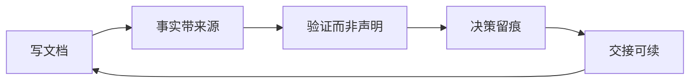
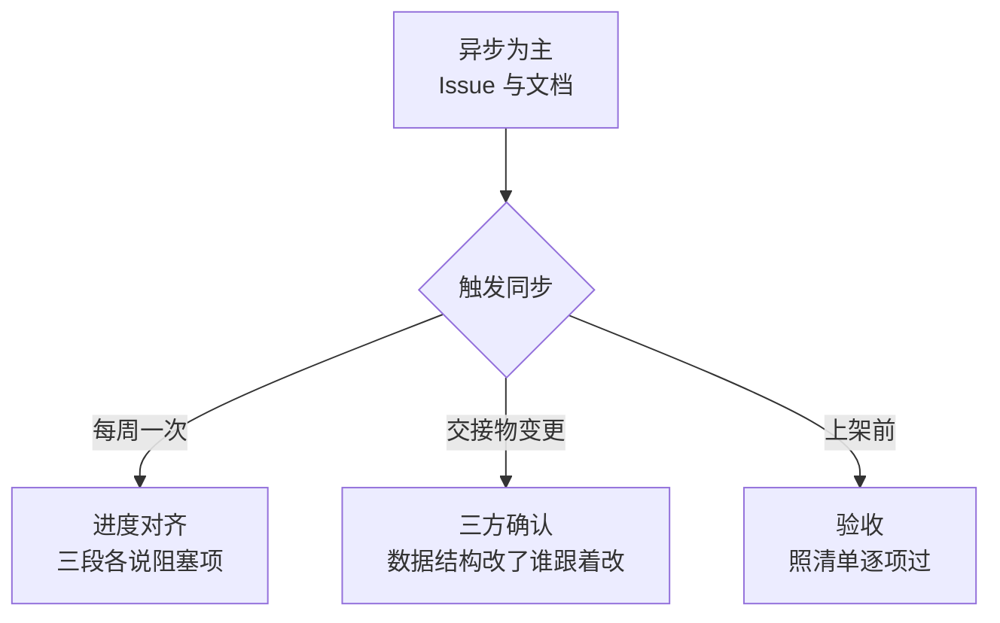

# 协作机制

三个人、三段流水线、每个人都带 AI 工作。机制要解决的核心问题：AI 产出快，瓶颈从写移到了验证和对齐。

## 五条规则

**事实带来源。** 涉及数据或接口的论断，附上能复核的位置或查询语句。读者要能三十秒确认。做不到就标「待验证」，不写成结论。

**验证而非声明。** AI 说「已完成」不等于完成。验证要在**最终形态**上做——本地渲染正常，不等于 WorkBuddy 会话里渲染正常。

**决策留痕。** 改变方向、推翻前提、选定方案，写决策记录，不留在聊天记录里。

**交接可续。** 一件事没做完就交出去时写交接文档。判据只有一条：接手的人不问任何问题，能不能继续。

**不重复定义。** 同一个事实只在一处定义，别处引用。发现两处说法不一致，停下来追究哪个是错的。

## 节奏

## 交接物变更走确认

两个交接物是三段的接口：规范化搜索请求、原始候选列表。

改动它们等于改别人的工作前提，所以不口头改——开 Issue 标 `交接物`，相关两方确认后落进决策记录。

## 决策记录

触发条件：推翻已有前提、在多个方案之间做了选择、约束了后续实现空间。

模板见 [ADR-模板.md](决策记录/ADR-模板.md)。写下选项和取舍，不只写结论——回头看的时候要知道当时为什么没选另一条。

## 文档写给谁看

| 文档 | 目标读者 | 要求 |
|---|---|---|
| 产品定义 | 三人与未来加入的人 | 顺读完成，不跳转 |
| 平台合规 | 做包与走审核的人 | 约束逐条可核 |
| 交接文档 | 接手的人 | 不问问题能续 |
| 决策记录 | 半年后回看的人 | 写下取舍不只写结论 |

**统一要求：短。** 用图和表承载结构，正文只写图表表达不了的。

压缩时先列必保清单——具体标识、口径数字、执行约束、失败模式一个都不能删。每删一处问一句：读者是少读了几个字，还是少知道了一件事。

## 上架后复盘

走完一轮做一次复盘，把有效的做法留下来，无效的去掉。文档结构、Issue 流转、交接方式都在复盘范围内。
