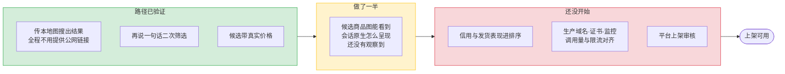
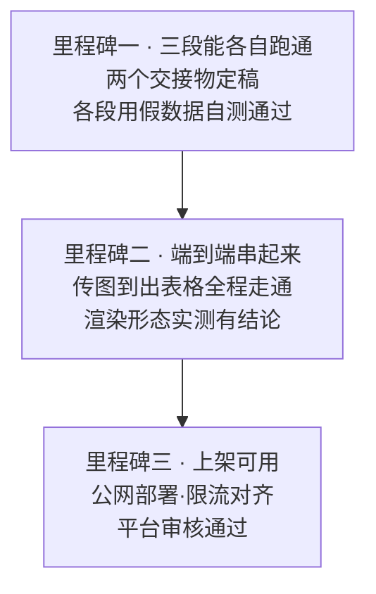

# 里程碑与任务板

目标：共创营期间上架可用，任意店主都能装上。

## 现在到哪

「路径已验证」指这条技术路径确认走得通，不代表交付件已就绪。服务当前只跑在一台本机上，公网部署尚未开始。

## 先解的三个未知

排在最前面的不是工作量最大的，是**不解开就会让后面全部返工**的。

| 未知 | 不解开会怎样 | 谁 |
|---|---|---|
| 会话原生怎么呈现候选 | 表格形态与返回结构可能全部推倒重来 | 怀志 |
| 「80 到 120」这种价格收窄怎么落地 | 两条上游的能力互补缺失，方案没定就实现不了二次筛选 | 三人共定 |
| 两份平台规范 | 上架的硬约束不清楚，包做完可能不合规 | 怀志索取 |

## 里程碑

里程碑一的完成判据是两个交接物定稿——数据结构定了，三段才能真正并行。

## 各线的起点任务

| 线 | 起点任务 | 为什么是它 |
|---|---|---|
| terence · 输入端 | 图片进入通道跑通：申请凭证、传字节、规整、换地址 | 对外依赖为零，不等任何人 |
| 正耀 · 服务端 | 服务骨架加一条上游对接 | 骨架不立起来，另两段没有落点 |
| 怀志 · 输出端 | 会话原生渲染形态实测 | 它的结论决定另外两段的返回结构 |

## 上架前逐项过

不是 Demo 标准，每项都要真的过。

- [ ] 店主传本地图片就能搜出结果，全程不需要他提供任何链接
- [ ] 结果能看到图，渲染形态实测确认，不是假设
- [ ] 再说一句话能做二次筛选，价格条件能落地
- [ ] 候选按信用与发货表现排序
- [ ] 真实凭据进密钥管理，生产域名、证书、监控到位
- [ ] 调用量与限流跟搜款网研发对齐一个安全上限
- [ ] 平台上架审核走完，任意店主都能装上

## Issue 怎么开

| 标签 | 含义 | 谁处理 |
|---|---|---|
| `输入端` | 图片通道、入参解析、条件映射、工具描述 | terence |
| `服务端` | 服务骨架、上游对接、部署 | 正耀 |
| `输出端` | 候选整理、排序、表格、Expert 包 | 怀志 |
| `交接物` | 涉及两个交接数据结构的变更 | 相关两方共同确认 |
| `阻塞` | 卡住了别人的工作 | 优先处理 |
| `待外部` | 等平台方或研发回复 | 怀志跟进 |

跨线需求一律开 Issue，写清楚要什么、为什么、验收标准。
