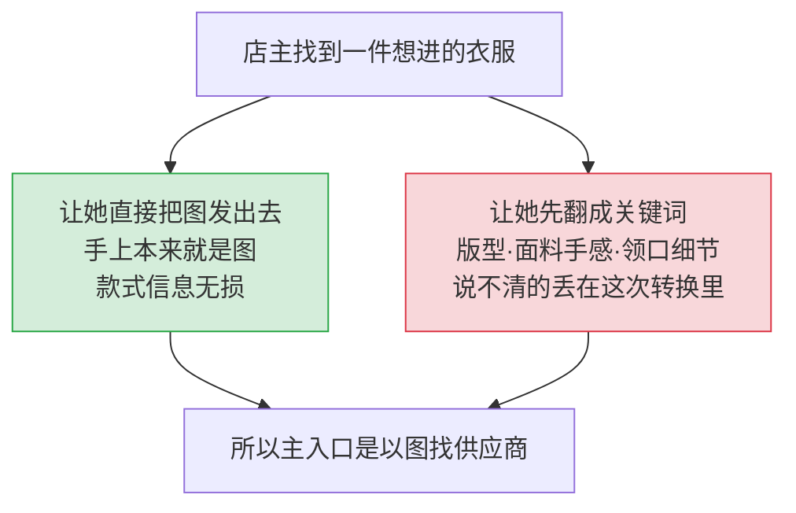
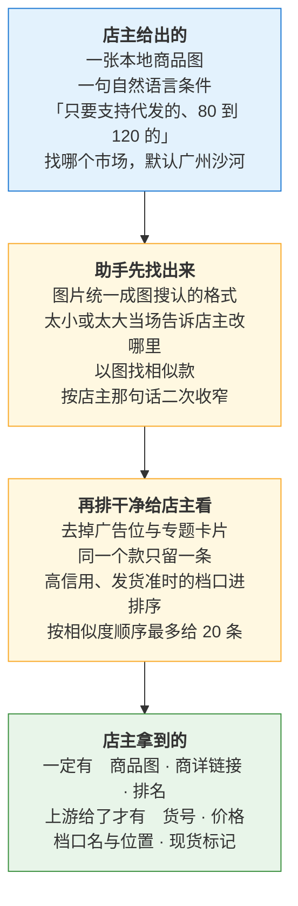

# 找款助手 PRD

## 解决谁的什么问题

服装网店店主看到一件想进的衣服——在档口里、竞品店铺里、客户发来的——想找到能进货的档口。

她手上有的是**图**，不是词。让她先把版型、面料手感、领口细节翻译成关键词，说不清的那部分就丢在这次转换里了。所以主入口是以图找供应商。

## 增量在哪

不在于能找到几款——搜款网 App 早就能传图找款。

新的是它**进了对话**：传完图再说一句「只要支持代发的、80 到 120 的」，结果就在这批里被收窄。这一步网页的筛选框承接不了。

文字找款承担补充与二次筛选，比如「广州沙河的欧货风衣」。

## 这一期做什么

店主全程只做两个动作：发一张图，再说一句话。

## 为什么要去广告、去重、按信用排

| 动作 | 理由 |
|---|---|
| 去掉广告位与专题卡片 | 店主看的是市场上有什么货，不是谁买了曝光 |
| 同一个款只留一条 | 上游会把同一个款在不同档口重复返回，不合并会显得候选很多其实只有几个款 |
| 高信用、发货准时的档口进排序 | 店主要的是能顺利拿到货的档口，不只是最像的款 |
| 最多 20 条 | 对话窗口里再多就翻不完了 |

按信用排是这一期唯一的新增能力。它不是纯技术选择——**相似度和信用怎么权衡是产品判断**，排太靠信用会把最像的款挤下去。

## 划在范围外

| 不做 | 说明 |
|---|---|
| 店主账号登录 | 三条上游都走不需要登录的公开接口 |
| 补齐上游没给的字段 | 空着就空着，不填一个看起来合理的值 |
| 反复重试 | 超时或连不上只再试一次 |
| 按店主偏好主动推荐 | 入口留了，能力这一期不开通 |
| 下单、支付、购物车、订单 | |
| 收藏、私信、联系供应商 | |
| 在 WorkBuddy 内收集店主的搜款网账号或凭据 | |

## 异常怎么答

| 情形 | 怎么答 | 不该怎么答 |
|---|---|---|
| 没找到 | 明说没有匹配，建议换一张更清楚的图 | 硬凑几个不相似的款 |
| 图太小或太大 | 说清楚具体是哪里不合适，引导重传 | 只说「图片有问题」 |
| 上游超时 | 再试一次，仍不行就如实说 | 自动重试到店主放弃 |
| 价格这次取不到 | 如实说本次价格不可用 | 静默省略，或填一个数 |
| 问库存 | 现货标记来自上游，不保证实时 | 承诺有货 |

**如实告知优先于体验流畅。** 一个编出来的货号会让店主白跑一趟档口。

## 上架标准

不是 Demo 标准，每项都要真的过。清单见 [里程碑与任务板](../00-团队协作/里程碑与任务板.md)。
