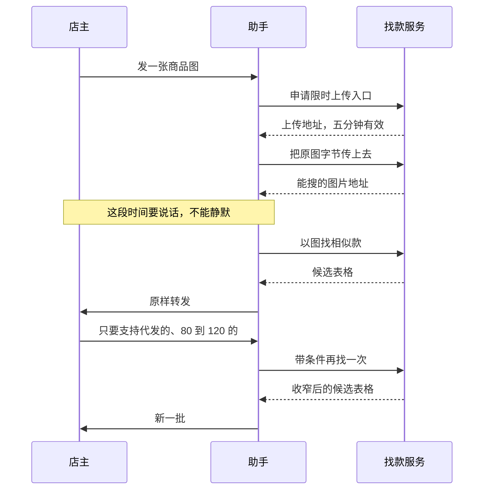

# 对话动线

店主在 WorkBuddy 里的完整体验，是 Agent 提示词与 Skill 编排的依据。

## 一次完整的找款

店主全程只做两个动作：发一张图，再说一句话。

## 四个节点

**进入时。** 首屏引导要让店主知道传图就行，不要让她先打字描述。首屏文案与第一条快捷提示必须字符级一致，这是平台的硬性要求。

**等待时。** 从发图到出结果中间有上传、规整、找款几步，助手必须有输出，否则店主会以为卡住了。至少说清楚正在上传和正在找款两个阶段。

**出结果时。** 候选表格由服务端渲染好，助手**原样转发不重排不改写**。这条要写进 SKILL 作为硬约束。

同时主动告诉店主可以怎么收窄——她不知道助手支持价格、代发、市场这些维度。

**收窄时。** 走带条件再找一次。价格区间这一条的具体落地方式还没定，见 [能力与工具清单](能力与工具清单.md)。

## 话术边界

| 场景 | 该说什么 | 不该说什么 |
|---|---|---|
| 没找到 | 明说没有匹配，建议换一张更清楚的图 | 硬凑几个不相似的款 |
| 图太小或太大 | 说清楚是尺寸还是格式不合适，引导重传 | 只说「图片有问题」 |
| 价格这次取不到 | 本次价格不可用，可以点进详情页看 | 静默省略，或填一个数 |
| 上游超时 | 再试一次，仍不行就如实说 | 自动重试到店主放弃 |
| 问库存 | 现货标记来自上游，不保证实时 | 承诺有货 |
| 问某个档口好不好 | 只讲候选里已有的信用与发货表现 | 用这几项下「这家靠谱」的全称判断 |

## 还没定的

- [ ] 价格区间的收窄怎么落地
- [ ] 等待期的具体文案与分段
- [ ] 店主连着发多张图怎么处理
- [ ] 店主发了非服装图片时怎么答
