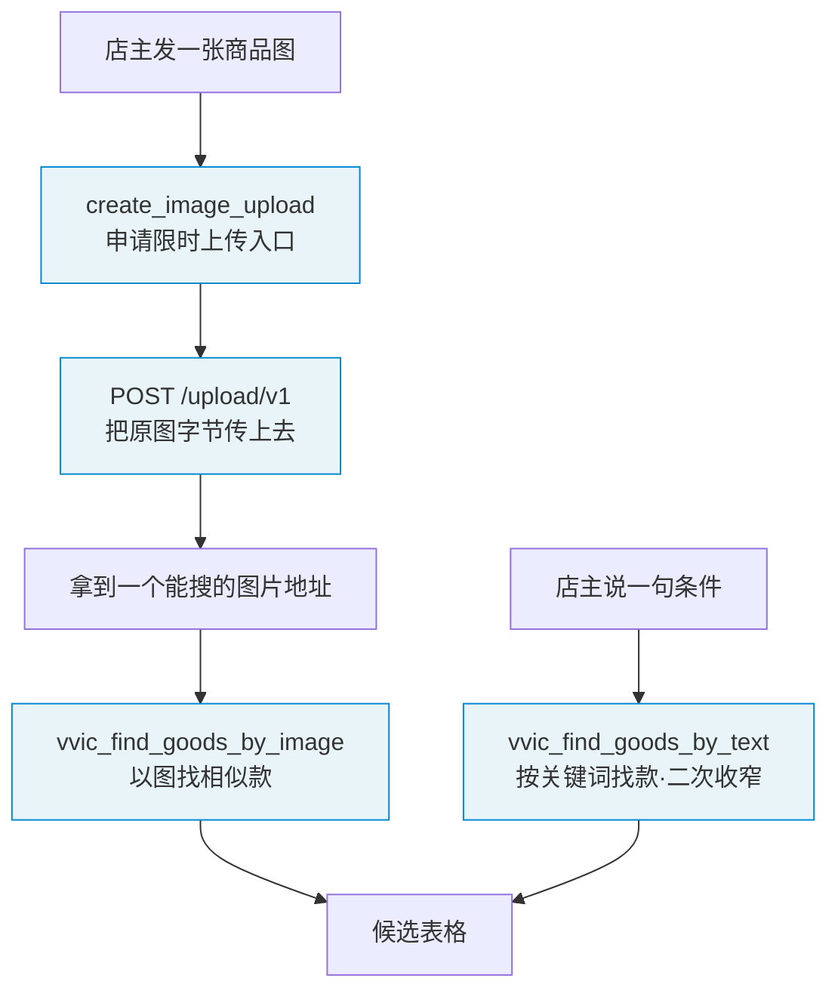

# 能力与工具清单

助手能干哪几件事、每件事的输入输出是什么。字段级的实现契约不在这份文档里。

## 三个工具加一条通道

| 名称 | 干什么 | 入 | 出 |
|---|---|---|---|
| `create_image_upload` | 申请限时上传入口。凭证签名算出来不落库，地址五分钟有效 | 无 | 上传地址与有效期 |
| `POST /upload/v1` | 接原图字节。先验签名再验过期，体积上限 20 MB，统一成 JPEG、长宽 100 到 4096 | 图片字节 | 能搜的图片地址 |
| `vvic_find_goods_by_image` | 以图找相似款 | 图片地址、市场、筛选条件 | 候选表格 |
| `vvic_find_goods_by_text` | 按关键词找款，也承担二次收窄 | 关键词、市场、筛选条件 | 候选表格 |

`POST /upload/v1` 不是工具，是一条普通的 HTTP 通道。

## 为什么图片要单独走一条通道

工具调用只能传文字参数，图片塞不进去。这是协议层的硬约束，不是权限问题，所以图片只能另开一条路进来。

代价是同一张凭证在五分钟有效期内可能被重复使用，这一条还没闭合。

## 为什么找款拆成两个工具而不是一个

两条路的契约根本不同：

| | 入参 | 能不能按价格筛 | 返回里有没有价格 |
|---|---|---|---|
| 以图找相似款 | 图片地址 | 不能 | 有 |
| 按关键词找款 | 关键词 | 能 | 没有 |

这个差异如果藏在一个工具的分支里，模型看不见。拆成两个工具，各自在描述里讲清楚，模型才不会在有图的时候去调文字找款。

工具总数控制在三个以内——工具太多模型选不准。

## 候选整理不做成第四个工具

去广告、去重、排序、渲染这一段，是找款工具内部的一步，不单独开工具。

原因是工具调用之间不保留状态。做成独立工具意味着模型要把 20 条候选的完整内容塞回参数再调一次，上下文翻倍、延迟翻倍，还多一次让模型改数字的机会。

所以这一段的边界定在数据结构上——从原始候选列表到店主看见的表格——不定在工具调用上。

## 一处待定

「只要支持代发的、80 到 120 的」这句话里，两个条件的落地难度不一样：

- **支持代发**：两条路都能筛，没问题
- **80 到 120**：以图找款的入参里没有价格区间；按关键词找款能按价格筛，但返回的价格字段是空的，而且丢掉了图搜的相似度

一个可行方向是以图找款时多取一些候选，在候选整理这一步按价格本地筛到 20 条——价格能看见、相似度也保住。取多少条要一起定，取太少筛完不够 20 条，取太多拖慢响应。

这条落决策记录，见 [决策记录](../00-团队协作/决策记录/README.md)。
