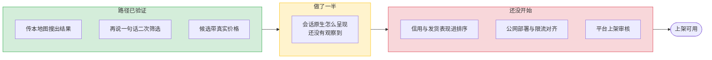

# 找款助手

店主在腾讯 WorkBuddy 里发一张商品图，找到搜款网上的相似货源，再说一句话就能在结果里收窄。

目标是上架可用，不是 Demo。

## 现在到哪

「路径已验证」指技术路径确认走得通，不代表交付件已就绪。服务当前只跑在一台本机上。

## 谁负责什么

按数据流切两刀，三个人各拿一段。

| 人 | 那一段做什么 |
|---|---|
| terence | 图片进入通道、入参解析、条件映射、工具描述 |
| 正耀 | 服务骨架、三条上游对接、候选映射、部署与限流 |
| 怀志 | 候选整理、排序、表格渲染、渲染实测、Expert 包与上架 |

边界是两个交接的数据结构，不是职能——各段可以独立开发、用假数据独立测试。详见 [分工与职责](00-团队协作/分工与职责.md)。

## 目录

| 目录 | 内容 |
|---|---|
| [00-团队协作](00-团队协作/) | 分工、机制、任务板、决策记录 |
| [01-产品定义](01-产品定义/) | PRD、能力与工具清单、对话动线、呈现规格 |
| [03-平台合规](03-平台合规/) | 平台规范、Expert 包规格、审核材料 |

代码不在这个仓库，这里只放项目管理与对齐材料。

## 从哪开始

本页 → [分工与职责](00-团队协作/分工与职责.md) → [能力与工具清单](01-产品定义/能力与工具清单.md) → [里程碑与任务板](00-团队协作/里程碑与任务板.md) → 自己那一段的文档。
